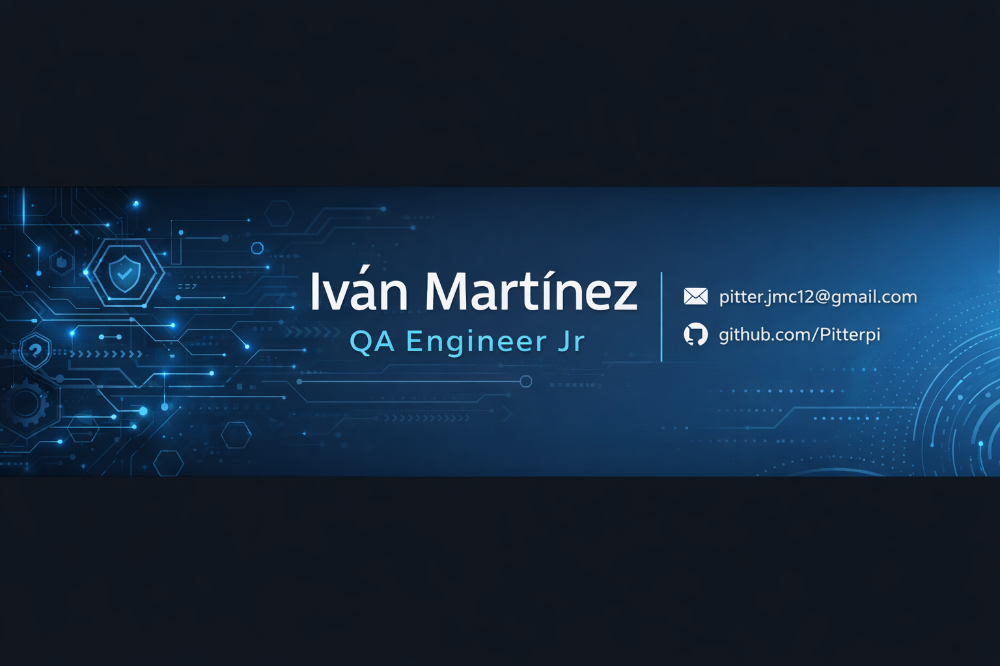

  

### 🧪 QA Engineer Jr | Manual Testing | API Testing | Bug Reporting

Welcome to my GitHub profile! I'm a QA Engineer in training at TripleTen Bootcamp, passionate about software quality and continuous learning.

---

## 🚀 About Me

- 🎓 QA Engineer Student at TripleTen Bootcamp  
- 🔍 Focused on Manual Testing and API Testing  
- 🐞 Experienced in Bug Reporting and Test Case Design  
- 🌎 Based in Tecate, Mexico  
- 📈 Actively building my QA portfolio  

---

## 🛠 Skills

---

## 📂 QA Projects

🔹 [QA Portfolio](https://github.com/Pitterpi/qa-portfolio)  
🔹 Smoke Testing and Bug Reporting  
🔹 Requirements Analysis & Test Case Design  

(More projects coming soon...)

---

## 📊 GitHub Stats

---

## 📫 Contact Me

- 📧 Email: pitter.jmc12@gmail.com  
- 💼 LinkedIn: https://linkedin.com/in/TU-USUARIO  
- 💻 GitHub: https://github.com/Pitterpi  

---

⭐ Thanks for visiting my profile!
